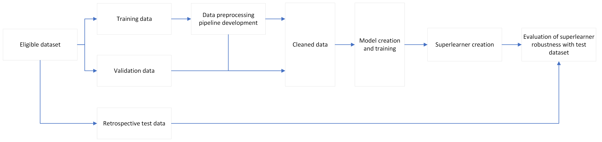
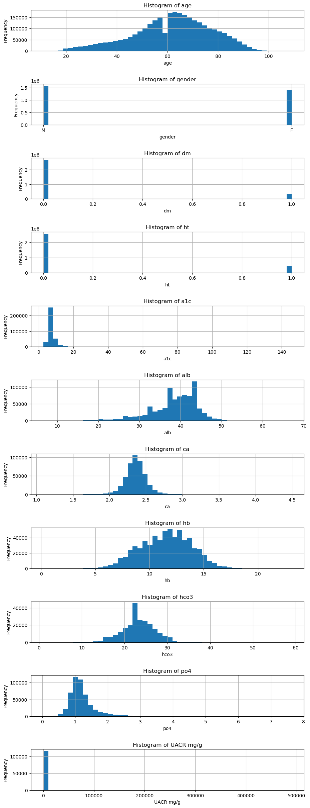

## Project TAROT: The AI-driven Renal Outcome Tracking

### Aim:
- To predict chronic kidney disease (CKD) progression using artificial intelligence (AI) models.

---

### Project Overview
This project utilizes data from patients routinely followed up at the three acute hospitals in the New Territories West Cluster, Hong Kong Hospital Authority. A test set was isolated before model creation and training to ensure robustness and generalizability. (Central IRB Ref, No: CIRB-2024-265-2)

**Data Preprocessing:**
- The training data preprocessing steps are illustrated in the following Jupyter Notebooks:
  - [file_converter.ipynb](code/file_converter.ipynb)
  - [pt_lister.ipynb](code/pt_lister.ipynb)
  - [data_retriever.ipynb](code/data_retriever.ipynb)

---

### How to Use the Model

This project predicts the **Cumulative Incidence Function (CIF)** for the following competing outcomes within five years:
1. Starting **renal replacement therapy (RRT)** or eGFR < 10 mL/min/1.73m².
2. **All-cause mortality**.

#### Data Requirements:
- Patients with eGFR between **10–60 mL/min/1.73m²**, maintained for at least **90 days**.

#### Data Format:
The input data should be structured as follows:

| gender | dm  | ht  | sprint | a1c    | po4     | UACR_mg_g | Cr       | age   | alb   | ca     | hb     | hco3   | key    | date_from_sub_60 |
|--------|------|-----|--------|--------|---------|-----------|----------|-------|-------|--------|--------|--------|--------|-----------------|
| 1.0    | 0.0  | 1.0 | 0.0    | xxxxx  | xxxxx   | xxxxx     | xxxxx    | xxxxx | xxxxx | xxxxx  | xxxxx  | xxxxx  | xxxxxx| xxxxx           |

**Variable Descriptions:**
- **gender:** 1 (male), 0 (female).
- **dm:** 1 (history of diagnosed diabetes or prescription of hypoglycemic agents), 0 (no history).
- **ht:** 1 (history of diagnosed hypertension or prescription of hypotensive agents), 0 (no history).
- **sprint:** 1 (history of cardiovascular complications per SPRINT trial criteria), 0 (none).
- **a1c:** Hemoglobin A1c levels (%).
- **po4:** Serum phosphate levels (mmol/L).
- **UACR_mg_g:** Urine albumin-creatinine ratio (mg/g).
- **Cr:** Serum creatinine levels (μmol/L).
- **age:** Patient age (years, rounded).
- **alb:** Serum albumin levels (g/L).
- **ca:** Serum calcium levels (mmol/L).
- **hb:** Hemoglobin levels (g/dL).
- **hco3:** Serum bicarbonate levels (mmol/L).
- **key:** Unique patient identifier.
- **date_from_sub_60:** Time since eGFR dropped below 60 mL/min/1.73m² (days).

**Note:** Each patient can have a sequence of up to 9 rows for prediction.

---

### Outcomes
- **Outcome 1 (Event Code: 1):** eGFR < 10 mL/min/1.73m² or starting RRT.
- **Outcome 2 (Event Code: 2):** All-cause mortality.
- **Outcome 0:** Data censored.

The project uses **DeepSurv** and **DeepHit** models for survival analysis with competing risks.

---

### Key Components
1. **Data Preprocessing:**
   - Code for cleaning, scaling, and imputation is in [dataloader2.py](code/dataloader2.py) (function: `create_pipeline`).

2. **Data Balancing:**
   - Dataset balancing methods are in [databalancer2.py](code/databalancer2.py).

3. **Model Creation:**
   - Neural network architectures are defined in [netweaver2.py](code/netweaver2.py).

4. **Model Training:**
   - Training and validation workflows are in [datatrainer2.py](code/datatrainer2.py).

5. **Model Evaluation:**
   - Evaluation scripts for robustness and prediction validation are in [modeleval.py](code/modeleval.py).

6. **Configurations:**
   - Model structures and hyperparameters are stored in [all_model_configs.json](code/models/all_model_configs.json).

7. **Model Weights:**
   - Pretrained model weights are stored in [code/models](code/models).

---

### Predictions
- Output: CIF predictions in a numpy array of shape **(2, 6, number_of_entries)**.
  - `output[0]`: CIF for **Outcome 1** (low eGFR/starting RRT).
  - `output[1]`: CIF for **Outcome 2** (all-cause mortality).
  - Time points: Predictions are made at 0, 1, 2, 3, 4, and 5 years.

- Example notebook: [meta_learner.ipynb](code/meta_learner.ipynb).

---

### Description of the dataset
The descriptive statistical analysis of the dataset in this project is preesented in the following:

---
### Performance of models
The perfomance of the ensembled model is presented in the following:

### References
1. **Paszke et al.** PyTorch: An Imperative Style, High-Performance Deep Learning Library. [NeurIPS 2019](http://papers.neurips.cc/paper/9015-pytorch-an-imperative-style-high-performance-deep-learning-library.pdf).
2. **Katzman et al.** DeepSurv: Personalized Treatment Recommender System Using a Cox Proportional Hazards Deep Neural Network. [BMC Medical Research Methodology 2018](https://doi.org/10.1186/s12874-018-0482-1).
3. **Lee et al.** DeepHit: A Deep Learning Approach to Survival Analysis With Competing Risks. [AAAI Conference on Artificial Intelligence](https://ojs.aaai.org/index.php/AAAI/article/view/11842).
4. **Kvamme et al.** PyCox: Python Package for Survival Analysis. [GitHub](https://github.com/havakv/pycox).
5. **SPRINT Research Group.** A Randomized Trial of Intensive vs Standard Blood-Pressure Control. [NEJM 2015](https://doi.org/10.1056/NEJMoa1511939).
